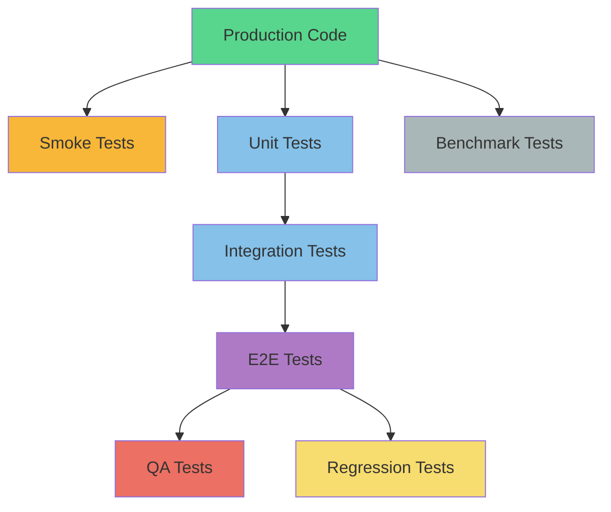
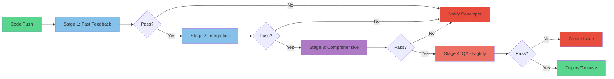
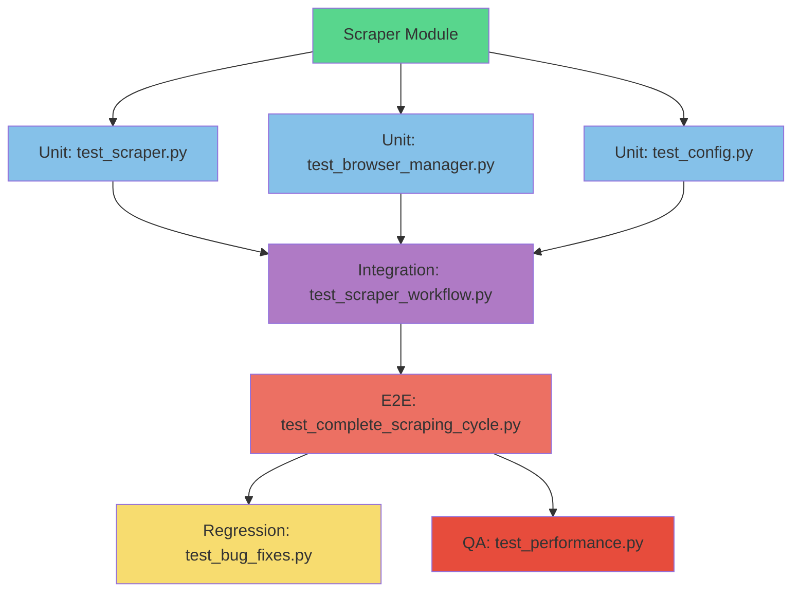
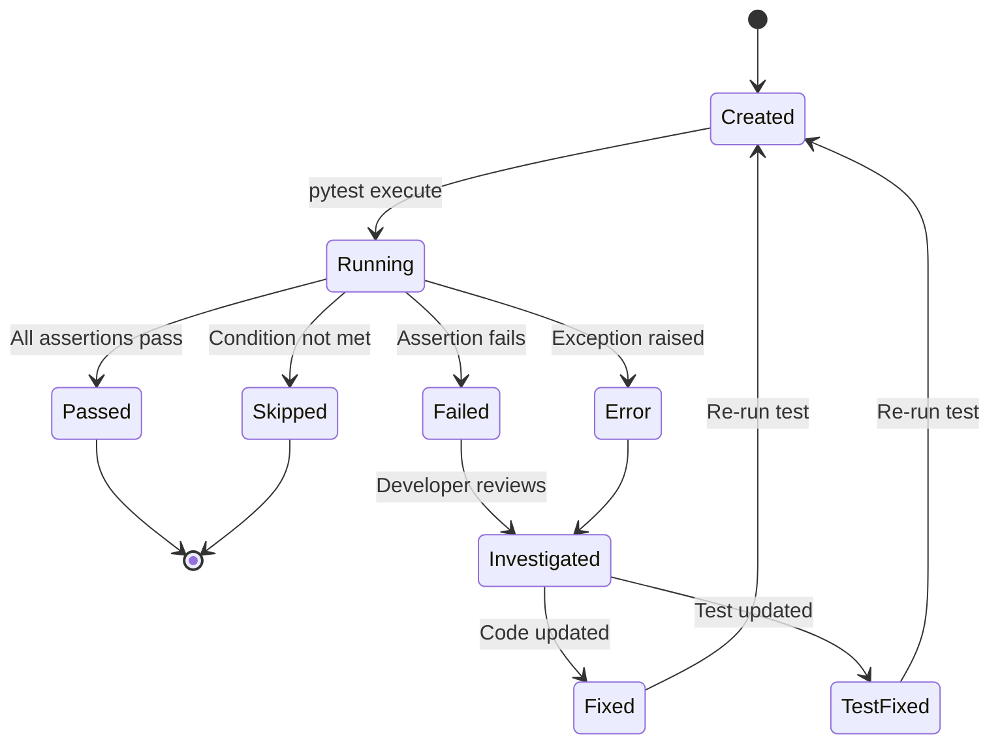
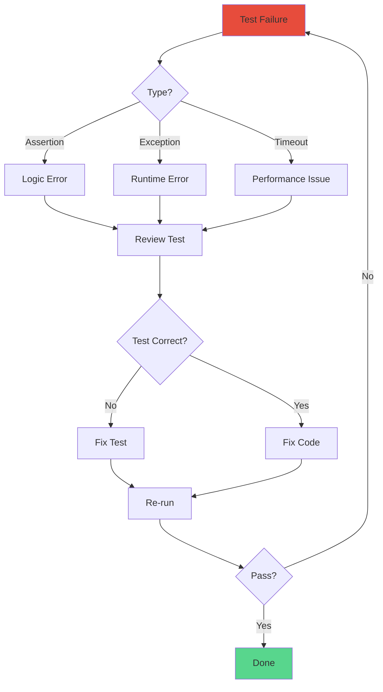

# 10. Architecture Diagrams

## Overview

This document provides visual representations of the test architecture, showing relationships, flows, and dependencies.

---

## Test Pyramid

```
         ┌─────────────┐
         │   Manual    │ (Exploratory, User Acceptance)
         └─────────────┘
      ┌─────────────────┐
      │    E2E Tests    │ (4 scenarios)
      │   ~1000 lines   │
      └─────────────────┘
    ┌───────────────────────┐
    │  Integration Tests    │ (10 workflows)
    │     ~2000 lines       │
    └───────────────────────┘
  ┌──────────────────────────────┐
  │       Unit Tests             │ (50+ modules)
  │       ~5000+ lines           │
  └──────────────────────────────┘

  [Fast, Deterministic, Many] → [Slow, Realistic, Few]
```

---

## Test Layers and Dependencies



---

## Test Type Hierarchy

```
Dynamic Web Scraper Tests
│
├── Smoke Tests (Critical Path Validation)
│   └── Basic scraping, export, config loading
│
├── Unit Tests (Component Isolation)
│   ├── Analytics
│   ├── Anti-Bot
│   ├── Comparison
│   ├── Core
│   ├── CSS Selectors
│   ├── Customization
│   ├── Data Parsers
│   ├── Data Processing
│   ├── Exceptions
│   ├── Export
│   ├── Logging Manager
│   ├── Plugins
│   ├── Proxy Manager
│   ├── Reporting
│   ├── Site Detection
│   ├── User Agent Manager
│   └── Utils
│
├── Integration Tests (Multi-Component Workflows)
│   ├── Analytics Generation
│   ├── Anti-Bot Flow
│   ├── Dashboard Integration
│   ├── Data Pipeline
│   ├── Distributed Scraping
│   ├── Export Pipeline
│   ├── Plugin Integration
│   ├── Proxy Rotation Flow
│   ├── Scraper Workflow
│   └── Site Detection Flow
│
├── E2E Tests (Complete User Journeys)
│   ├── Complete Scraping Cycle
│   ├── Dashboard Workflow
│   ├── Multi-Site Comparison
│   └── Real Site Scraping
│
├── QA Tests (Quality Assurance)
│   ├── Compatibility
│   │   ├── Browser Compatibility
│   │   ├── Platform Compatibility
│   │   ├── Python Versions
│   │   └── Selenium Versions
│   ├── Performance
│   │   ├── Concurrent Requests
│   │   ├── Database Performance
│   │   ├── Large Dataset Handling
│   │   ├── Memory Usage
│   │   └── Scraping Speed
│   ├── Reliability
│   │   ├── Connection Stability
│   │   ├── Data Consistency
│   │   ├── Error Recovery
│   │   ├── Retry Mechanism
│   │   └── Timeout Handling
│   ├── Scalability
│   │   ├── Load Handling
│   │   ├── Queue Scalability
│   │   └── Worker Scaling
│   ├── Security
│   │   ├── Input Sanitization
│   │   ├── Proxy Security
│   │   ├── Sensitive Data Handling
│   │   ├── SQL Injection Prevention
│   │   └── XSS Prevention
│   └── Usability
│       └── API Ergonomics
│
├── Regression Tests (Bug Prevention)
│   ├── Bug Fixes
│   └── Deprecated Features
│
└── Benchmark Tests (Performance Tracking)
    ├── Parsing Benchmarks
    └── Scraping Benchmarks
```

---

## CI/CD Pipeline Flow



### Pipeline Stages Details

**Stage 1: Fast Feedback (< 2 min)**
```
┌─────────────────┐
│  Smoke Tests    │ ← Critical paths
├─────────────────┤
│  Unit Tests     │ ← All modules
├─────────────────┤
│  Linting        │ ← Code style
└─────────────────┘
```

**Stage 2: Integration (5-10 min)**
```
┌─────────────────────┐
│ Integration Tests   │ ← Component interaction
├─────────────────────┤
│ Coverage Analysis   │ ← Code coverage
└─────────────────────┘
```

**Stage 3: Comprehensive (15-30 min)**
```
┌─────────────────────┐
│ E2E Tests           │ ← Full workflows
├─────────────────────┤
│ Regression Tests    │ ← Bug prevention
├─────────────────────┤
│ Benchmark Tests     │ ← Performance check
└─────────────────────┘
```

**Stage 4: QA (30-60 min) - Nightly Only**
```
┌─────────────────────┐
│ Compatibility       │ ← Cross-platform
├─────────────────────┤
│ Performance         │ ← Load tests
├─────────────────────┤
│ Security            │ ← Vulnerability scans
├─────────────────────┤
│ Reliability         │ ← Failure handling
├─────────────────────┤
│ Scalability         │ ← Horizontal scaling
└─────────────────────┘
```

---

## Test Dependency Flow



---

## Scraper Module Test Coverage Map

```
scraper/
├── core/
│   └── scraper.py
│       ├── Unit: test_scraper.py (90% coverage)
│       ├── Integration: test_scraper_workflow.py
│       └── E2E: test_complete_scraping_cycle.py
│
├── proxy_manager/
│   └── proxy_manager.py
│       ├── Unit: test_proxy_manager.py (85% coverage)
│       └── Integration: test_proxy_rotation_flow.py
│
├── data_parsers/
│   └── html_parser.py
│       ├── Unit: test_html_parser.py (90% coverage)
│       └── Integration: test_data_pipeline.py
│
└── export/
    └── exporters.py
        ├── Unit: test_exporters.py (85% coverage)
        └── Integration: test_export_pipeline.py
```

---

## Test Execution Time Distribution

```
Full Test Suite: ~60 minutes

Smoke Tests:        █  (< 1 min, 1.5%)
Unit Tests:         ████  (2 min, 3%)
Integration Tests:  ████████  (8 min, 13%)
E2E Tests:          ████████████████  (18 min, 30%)
QA Tests:           ████████████████████████  (28 min,47%)
Regression Tests:   ██  (2 min, 3%)
Benchmark Tests:    ██  (2 min, 3%)
```

---

## Data Flow: Complete Scraping Cycle

```
User Input
    │
    ▼
┌────────────┐
│ Configure  │
│  Scraper   │
└─────┬──────┘
      │
      ▼
┌────────────┐    ┌──────────────┐
│  Site      │───▶│ Select       │
│ Detection  │    │ Config       │
└────────────┘    └──────┬───────┘
                         │
                         ▼
                  ┌──────────────┐
                  │ Initialize   │
                  │  Browser     │
                  └──────┬───────┘
                         │
                         ▼
                  ┌──────────────┐
                  │   Fetch      │◀─── Proxy Manager
                  │   HTML       │◀─── User Agent Manager
                  └──────┬───────┘
                         │
                         ▼
                  ┌──────────────┐
                  │   Parse      │
                  │   Data       │
                  └──────┬───────┘
                         │
                         ▼
                  ┌──────────────┐
                  │  Process     │
                  │   Data       │
                  └──────┬───────┘
                         │
                         ▼
                  ┌──────────────┐
                  │   Export     │
                  │ (JSON/CSV)   │
                  └──────┬───────┘
                         │
                         ▼
                    User Output

Tests Cover Each Stage:
• Unit: Each component individually
• Integration: Component transitions
• E2E: Complete flow end-to-end
```

---

## Test Infrastructure Components

```
┌─────────────────────────────────────────┐
│         Test Infrastructure             │
├─────────────────────────────────────────┤
│                                         │
│  ┌──────────┐  ┌──────────┐           │
│  │Fixtures  │  │ Helpers  │           │
│  ├──────────┤  ├──────────┤           │
│  │HTML      │  │Assertions│           │
│  │JSON      │  │Factories │           │
│  │CSV       │  │Mocks     │           │
│  │Configs   │  │Server    │           │
│  └──────────┘  └──────────┘           │
│                                         │
│  ┌──────────────────────────┐          │
│  │   PyTest Configuration   │          │
│  ├──────────────────────────┤          │
│  │ pytest.ini               │          │
│  │ conftest.py              │          │
│  │ .coveragerc              │          │
│  └──────────────────────────┘          │
│                                         │
│  ┌──────────────────────────┐          │
│  │   Test Runners           │          │
│  ├──────────────────────────┤          │
│  │ run_unit_tests.py        │          │
│  │ run_integration_tests.py │          │
│  │ run_e2e_tests.py         │          │
│  │ run_qa_tests.py          │          │
│  │ run_full_suite.py        │          │
│  └──────────────────────────┘          │
└─────────────────────────────────────────┘
```

---

## Test States and Transitions



---

## Parallel Test Execution

```
Serial Execution (20 minutes):
Test 1 ████
Test 2     ████
Test 3         ████
Test 4             ████
Test 5                 ████

Parallel Execution (5 minutes):
Worker 1: Test 1 ████
Worker 2: Test 2 ████
Worker 3: Test 3 ████
Worker 4: Test 4 ████
Worker 5: Test 5 ████

4x Speed Improvement
```

---

## Coverage Heat Map

```
Module Coverage Visualization:

scraper/core/          ████████████████████  95%
scraper/parsers/       ███████████████████   90%
scraper/proxy_manager/ ██████████████████    85%
scraper/export/        ██████████████████    85%
scraper/anti_bot/      ████████████████      80%
scraper/analytics/     ███████████████       75%
scraper/plugins/       █████████████         65%
scraper/dashboard/     ████████████          60%

Legend: ████ = 10% coverage
Target: 80%+ for all core modules
```

---

## Test Failure Analysis Flow



---

## Summary

These diagrams provide visual representations of:
- Test architecture layers and relationships
- CI/CD pipeline flow
- Test execution strategies
- Coverage distribution
- Data flow through the system

Use these diagrams to:
- Understand the overall test structure
- Plan test additions
- Identify gaps in coverage
- Optimize test execution
- Communicate architecture to stakeholders

---

## Next Steps

- **Best Practices**: [11. Best Practices](11_best_practices.md)
- **Overview**: [00. Overview](00_overview.md)
- **Writing Tests**: [09. Writing New Tests](09_writing_new_tests.md)
